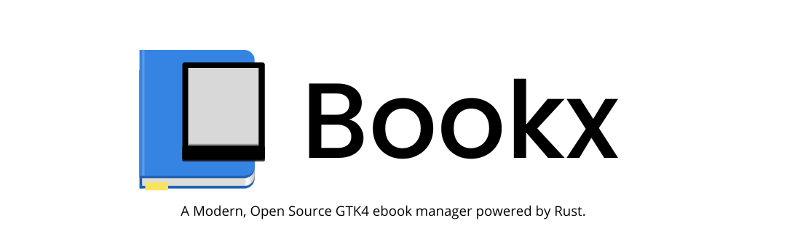
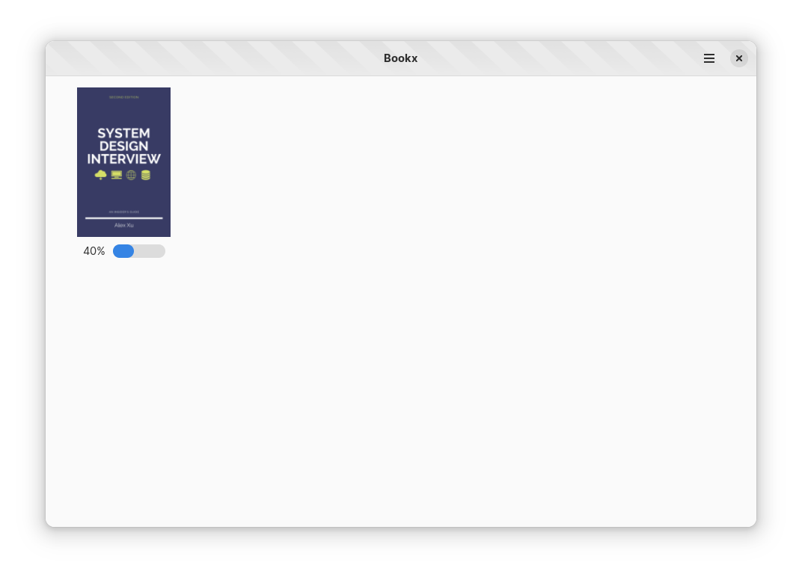

# Bookx
[](https://stopthemingmy.app)

An MVP in progress:
- [Mockups](/mockups/)
    - [X] Mockup for Library
    - [X] Mockup for Reader
    - [ ] Mockup for editor
- [ ] An ebook reader with .epub support
    - [ ] Context menu for each book (delete, rename book, info)
    - [ ] On click switch the carousal to the book
- [ ] Ebook editor for .epub files

<div align="center">



</div>

# Pronunciation
The app is pronounced just like "Books" but the "s" replaced with "x", as in an extension of something that manages your books. And not "Book-ex" :)

# Build & Run the project

Building the project

```bash
flatpak install org.gnome.Sdk//43 org.freedesktop.Sdk.Extension.rust-stable//22.08 org.gnome.Platform//43
flatpak-builder --user flatpak_app build-aux/com.adhadse.Bookx.Devel.json
```

To run the project

```bash
flatpak-builder --run flatpak_app build-aux/com.adhadse.Bookx.Devel.json bookx
```
> Please note that these commands are just for demonstration purposes. Normally this would be handled by your IDE, such as GNOME Builder or VS Code with the Flatpak extension.

# Wanna learn? Come and Contribute!
For those doing there first-time contribution, check our [good first issue](https://github.com/adhadse/Bookx/issues?q=is%3Aopen+is%3Aissue+label%3A%22good+first+issue%22). 

- Go through the issue, can you understand them? Talk to devs and understand how to proceed. And if yes, try compiling it on your system.
- This project uses Rust, so a good understanding of Rust is prerequisite, check out [The Rust Programming Language Book](https://doc.rust-lang.org/stable/book/). 
- If interested in design, file an issue, explain your need, and update mockups!
- This is a GNOME app, so do read [GNOME Human Interface Guidelines](https://developer.gnome.org/hig/), it's interesting what goes behind making apps for our users.
- Beyond that even filing an issue and reporting failure and feedback is counted as contribution.

Dependency libraries and documentation is in [_developer](https://github.com/adhadse/Bookx/blob/master/_developer/docs.md) folder.

For seasoned folks, skip ignore good first issue, and dive in.

