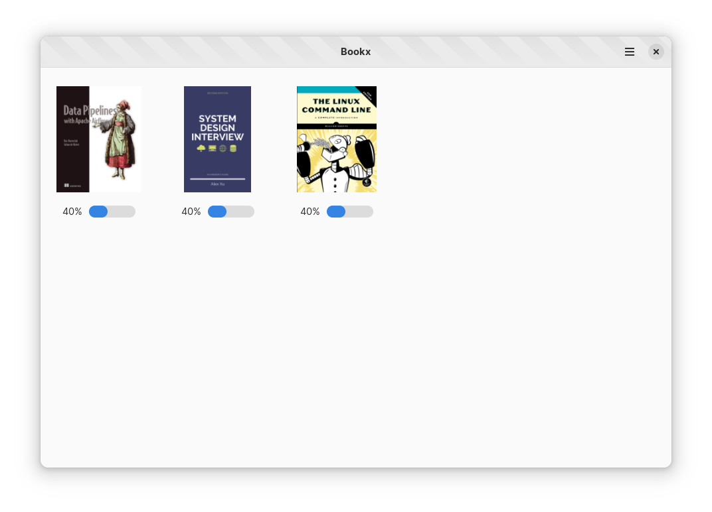

# Bookx
A Modern, Open Source GTK4 application for ebook managment written in Rust. (WIP)

<div align="center">



</div>

## Build & Run the project

Building the project

```bash
flatpak install org.gnome.Sdk//41 org.freedesktop.Sdk.Extension.rust-stable//21.08 org.gnome.Platform//41
flatpak-builder --user flatpak_app build-aux/com.anuragdhadse.Bookx.Devel.json
```

To run the project

```bash
flatpak-builder --run flatpak_app build-aux/com.anuragdhadse.Bookx.Devel.json bookx
```
> Please note that these commands are just for demonstration purposes. Normally this would be handled by your IDE, such as GNOME Builder or VS Code with the Flatpak extension.

